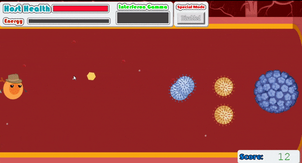

# Javascript Capstone Project - Virus Defender Shooter Game

[](https://app.netlify.com/sites/virus-defender/deploys)
[]()
[]()
[]()

<br />
<p align="center">
  <a href="https://github.com/ldelbel/vd-game">
    
  </a>

  <h2 align="center">Virus Defender</h2>

  <h3 align="center">Capstone Project - Building a Javascript Game using Phaser 3<h3>
  <p align="center">
    <a href="https://github.com/ldelbel/vd-game"><strong>Explore the docs »</strong></a>
    <br />
    <br />
    -
    <a href="https://github.com/ldelbel/vd-game/issues">Report Bug</a>
    -
    <a href="https://github.com/ldelbel/vd-game/pulls">Request Feature</a>
    -
  </p>
</p>
    
## Content

<p align="center">
  <a href="#about">About</a> •
  <a href="#ins">Installing</a> •
  <a href="#testing">Testing</a> •
  <a href="#with">Built With</a> •
  <a href="#tested">Tested With</a> •
  <a href="#author">Author</a>
</p>

## About the Game <a name = "about"></a>
 
Virus Defender is a game where you control a lymphocyte B cell, and your goal is to defend your host from the attack of nasty viruses. You'll shoot all of them down with your antibody bullets to keep your host healthy for as long as possible.  

This game is inspired on the fight we're having against SARS-CoV-2.

&nbsp;&nbsp;&nbsp;&nbsp;&nbsp;&nbsp;&nbsp;&nbsp;&nbsp;&nbsp;&nbsp;&nbsp;&nbsp;&nbsp;&nbsp;&nbsp;&nbsp;&nbsp;&nbsp;&nbsp;&nbsp;&nbsp;&nbsp;&nbsp;&nbsp;&nbsp;&nbsp;&nbsp;&nbsp;&nbsp;&nbsp;  


## How to Play <a name = "ldl"></a>

The game comes with a Tutorial to help newcomers understand how to play.

## Live Demo Link <a name = "ldl"></a>

[Play this Fantastic Game Here](https://virus-defender.netlify.app/)

## Game Development

### • Ideation
  
In the planning phase of the process my main goal was to set the theme, the core idea, and be able to imagine what I wanted it to look and how it would work and feel. I wanted to improve the relevance of this project by adding some context that people could recognize. That's why I decided to make it referencing to this time of pandemics. I had a very clear idea of how I wanted the game, and every step in the way and the extra effort applied in graphics and interface creation was to fulfill that vision.

### • Designing

The designing of the game was one of the most important phases, because I had the goal to make it look and feel just like I imagined originally. I found a very good resource for many of the game assets, which helped a lot (and it is cited in ackowledgements), but there is a lot of content I created myself using Photoshop.

### • Development

Working with Phaser 3 was very interesting and after speding some time learning how it works you start loving it (or at least respect the work behind it). The library is amazing and it is probably one of the best tools for creating games using Javascript, which is by itself a powerful achievement. 

I listed the main features I wanted in my game and went through each one of them following the information on Phaser 3 documentation. Sometimes it got confusing but after a while I became familiarized with the mindset behind the library, which helped me a lot to understand the new information I was constantly dealing with.

The steps of the development process were briefly the following:

- Set the Phaser Environment
- Start designing the Game Scene:
  - Create helpers and objects for storing important data
  - Create the player character and it's features
  - Create the enemies and their features
  - Set the relations between player, enemies, bullets, boundaries
  - Set the variables and rules of the game
  - Build the interface to handle the variables that interact with the rules of the game
- Design the other scenes
- Apply sounds
- Use API for leaderboard
- Finishing

I used one side resource for Phaser called WeaponPlugin. 

### • Deployment

The deployment was made very easy by Netlify, which dealt perfectly with the webpack configuration, the yarn setup, and the node packages.


## 🔧 Built with <a name = "with"></a>

- Javascript
- Webpack
- PhaserJS

## 🔧 Tested with <a name = "tested"></a>

- Jest

## 🛠 Requirements <a name = "req"></a>

You'll need a package manager to install the dependencies listed in package.json in order to make the game work in your local machine.

The project was built using yarn, so it's recommended to have yarn installed. If you don't have it yet, you can follow the instructions in the link below.

[Yarn Installation Guide](https://classic.yarnpkg.com/en/docs/install/#debian-stable)

If you have node.js installed already, you can substitute the yarn commands recommended here for npm

## 🔨 Setup and Installing <a name = "ins"></a>

To setup the project, run the following commands on terminal:

```
$ cd <folder> (the place you want to have the files installed)
$ git clone https://github.com/ldelbel/vd-game.git
$ cd vd-game
$ yarn install

```

This will install the dependencies in your local machine. This process can take a few minutes.

## 🔨 Running the Game Locally

After installing the dependencies you can start your game running the code below

```
$ yarn start

```
If your default broswer doesn't open automatically, visit http://localhost/8080 to start the game.


## 🛠 Testing <a name = "testing"></a>

To run the tests (built with Jest), run the command below

```
$ yarn test

```

## ✒️ Author <a name = "author"></a>

👤 **Lucas Delbel**

- Github: [@ldelbel](https://github.com/ldelbel)
- Twitter: [@delbel_lucas](https://twitter.com/delbel_lucas)
- Linkedin: [lucasdelbel](https://www.linkedin.com/in/lucasdelbel/)

## 🤝 Contributing

Contributions, issues and feature requests are welcome!

Feel free to check the [issues page]().

## 👍 Show your support

Give a ⭐️ if you like this project!

## :clap: Acknowledgements

- Microverse: [@microverse](https://www.microverse.org/)
- PhaserJS: [@phaser](https://www.microverse.org/)
- BioRender.com: [@biorender](https://www.microverse.org/)
- Zapsplat.com: [@zapsplat](https://www.microverse.org/)

