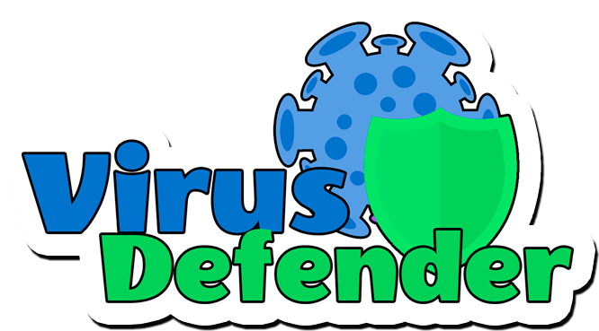

# Javascript Capstone Project - Virus Defender Shooter Game

[]()
[]()
[]()

<br />
<p align="center">
  <a href="https://github.com/ldelbel/vd-game">
    
  </a>

  <h2 align="center">Virus Defender</h2>

  <h3 align="center">Capstone Project - Building a Javascript Game using Phaser 3<h3>
  <p align="center">
    <a href="https://github.com/ldelbel/vd-game"><strong>Explore the docs »</strong></a>
    <br />
    <br />
    -
    <a href="https://github.com/ldelbel/vd-game/issues">Report Bug</a>
    -
    <a href="https://github.com/ldelbel/vd-game/pulls">Request Feature</a>
    -
  </p>
</p>
    
## Content

<p align="center">
  <a href="#about">About</a> •
  <a href="#ins">Installing</a> •
  <a href="#testing">Testing</a> •
  <a href="#with">Built With</a> •
  <a href="#tested">Tested With</a> •
  <a href="#author">Author</a>
</p>

## About the Game <a name = "about"></a>
 
Virus Defender is a game where you control a lymphocyte B cell, and your goal is to defend your host from the attack of nasty viruses. You'll shoot all of them down with your antibody bullets to keep your host healthy for as long as possible.  

This game is inspired on the fight we're having against SARS-CoV-2.

   

The game comes with a Tutorial to help newcomers understand how it works.


## Live Demo Link <a name = "ldl"></a>

[Play this Fantastic Game Here](https://virus-defender.netlify.app/)

## 🔧 Built with <a name = "with"></a>

- Javascript
- Webpack
- PhaserJS

## 🔧 Tested with <a name = "tested"></a>

- Jest

## 🛠 Requirements <a name = "req"></a>

You'll need a package manager to install the dependencies listed in package.json in order to make the game work in your local machine.

The project was built using yarn, so it's recommended to have yarn installed. If you don't have it yet, you can follow the instructions in the link below.

[Yarn Installation Guide](https://classic.yarnpkg.com/en/docs/install/#debian-stable)

If you have node.js installed already, you can substitute the yarn commands recommended here for npm

## 🔨 Setup and Installing <a name = "ins"></a>

To setup the project, run the following commands on terminal:

```
$ cd <folder> (the place you want to have the files installed)
$ git clone https://github.com/ldelbel/vd-game.git
$ cd vd-game
$ yarn install

```

This will install the dependencies in your local machine. This process can take a few minutes.

## 🔨 Running the Game Locally

After installing the dependencies you can start your game running the code below

```
$ yarn start

```
If your default broswer doesn't open automatically, visit http://localhost/8081 to start the game.


## 🛠 Testing <a name = "testing"></a>

To run the tests (built with Jest), run the command below

```
$ yarn test

```

## ✒️ Author <a name = "author"></a>

👤 **Lucas Delbel**

- Github: [@ldelbel](https://github.com/ldelbel)
- Twitter: [@delbel_lucas](https://twitter.com/delbel_lucas)
- Linkedin: [lucasdelbel](https://www.linkedin.com/in/lucasdelbel/)

## 🤝 Contributing

Contributions, issues and feature requests are welcome!

Feel free to check the [issues page]().

## 👍 Show your support

Give a ⭐️ if you like this project!

## :clap: Acknowledgements

- Microverse: [@microverse](https://www.microverse.org/)
- PhaserJS: [@phaser](https://www.microverse.org/)
- BioRender.com: [@biorender](https://www.microverse.org/)
- Zapsplat.com: [@zapsplat](https://www.microverse.org/)

